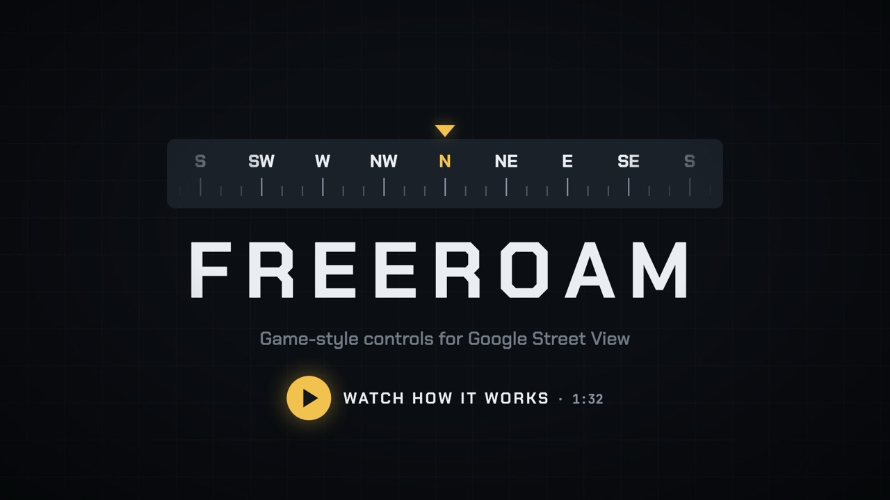
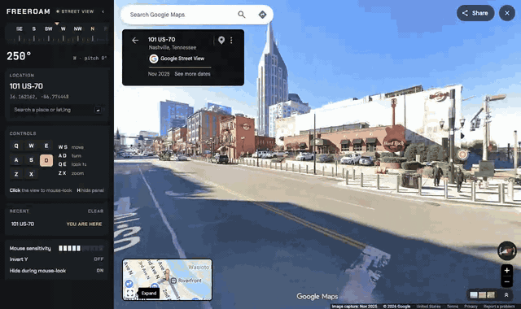
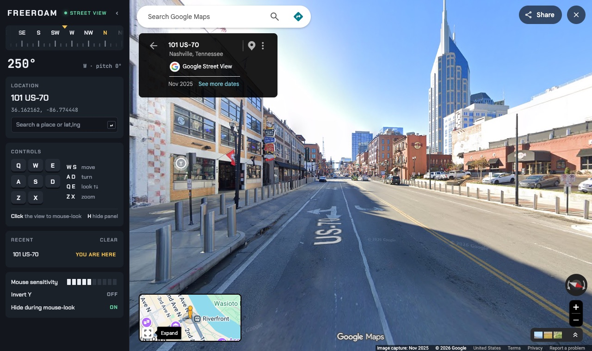

# FreeRoam

**Game-style controls for Google Street View.** WASD to move, mouse-look like a first-person game, zoom that doesn't tilt, and a docked HUD panel that never covers the map. No API key, no account, nothing leaves your computer.

[](docs/freeroam-how-it-works.mp4)



## Controls

| Key | Does |
|---|---|
| **W / S** | Step forward / back along the street |
| **A / D** | Turn left / right (hold for a smooth turn) |
| **Q / E** | Look up / down |
| **Z / X** | Zoom in / out (or scroll wheel / pinch) |
| **Click the view** | Mouse-look: the pointer locks like a game, **Esc** releases it |
| **H** | Hide / show the panel |

Everything works the moment Street View loads; there's no "click once to activate".

## Features

- **Docked HUD panel:** Google Maps lays out beside it, so the search box, info card and minimap stay visible. Hide it with **H** or the ‹ button for a full-width view; during mouse-look it slides away on its own.
- **Heading tape:** a compass strip that slides as you turn, with heading and pitch readouts.
- **Zoom goes straight in:** Google zooms toward the mouse pointer, which tilts the view. FreeRoam zooms at the center, and keeps look speed the same at any zoom.
- **Search → Street View:** type a place name and you land on the street in front of it, facing it (skipping indoor photo spheres). Or paste `lat,lng`.
- **Recent places:** your last 8 spots with the distance from where you are now. One click to go back.
- **Settings:** mouse sensitivity, invert Y, auto-hide during mouse-look.



## Install

FreeRoam isn't in the Chrome Web Store yet. To install it from this repository:

1. [Download the ZIP](../../archive/refs/heads/main.zip) (or `git clone` this repo) and unzip it
2. Open `chrome://extensions` and turn on **Developer mode** (top right)
3. Click **Load unpacked** and select the unzipped folder
4. Click the FreeRoam toolbar icon — Street View opens on Lower Broadway, Nashville (or wherever you were last)

Works in Chrome 111+ and Chromium browsers (Edge, Brave, Arc).

## How it works

The Google Maps website doesn't expose Google's JavaScript API, so FreeRoam drives Street View the way a person would:

- **Moving and turning** are synthetic arrow-key events sent to the Street View canvas; Street View's own keyboard handling does the rest (so **S** is a true step back).
- **Looking, mouse-look and zoom** are synthetic drags and wheel events, scaled for the current zoom level.
- **Position and heading** are read from the page URL (`@lat,lng,…,heading h,pitch t`).
- **Docking** turns Google's page body into a box beside the panel, so Maps sizes itself to the remaining space.

The code is plain JavaScript and CSS with no build step: `content.js` (panel, keys, mouse-look), `pageScript.js` (runs in the page to talk to the Street View canvas), `background.js` (toolbar icon), `sidebar.css`.

## Development

```bash
npm install                 # installs Playwright (dev only)
npx playwright install chromium
npm test                    # smoke test: loads the extension on a real pano and checks every control
npm run package             # builds dist/freeroam-<version>.zip
```

Google changes the Maps page from time to time. When a control stops working, `npm test` shows which one; the two brittle spots are the Street View canvas lookup and the URL format, both in `pageScript.js`.

## Known limitations

- **W** only moves when there's a road roughly ahead, the same rule as Google's own viewer; at the end of the imagery **W** or **S** does nothing.
- Place search sometimes lands in an alley beside a building, or right against a big venue's wall.
- FreeRoam depends on Google Maps' page structure and one undocumented lookup (used by place search), so a Google update can break it until it's fixed here.

## Privacy

FreeRoam stores your last location, recent places and settings **only on your computer** and sends nothing to anyone. Details: [PRIVACY.md](PRIVACY.md).

## License & credits

Made by **MMH Adventures LLC**. MIT — see [LICENSE](LICENSE). Bundled fonts: [Chakra Petch](https://fonts.google.com/specimen/Chakra+Petch) and [JetBrains Mono](https://www.jetbrains.com/lp/mono/), both under the SIL Open Font License (`fonts/`).

FreeRoam is an independent project and is **not affiliated with, endorsed by, or sponsored by Google**. Google Maps and Street View are trademarks of Google LLC. Street View imagery in the screenshots © Google.
